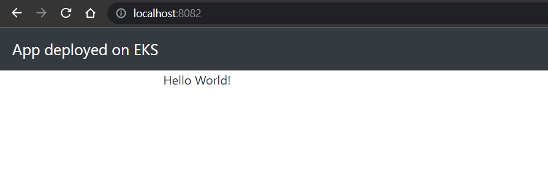

# tf-safe-deployment


Repository that stores the files created with **Terraform** , Dockerfile and manifest to deploy an hello world app made with spring boot and java 16


* helm\jenkins containts **values.yaml** , this files is used with **Helm** to install **Jenkins** on EKS
* infra directorio que tiene los archivos **.tf** que en conjunto con **Terraform** Definimos los recursos necesarios 
  para el provisionamiento de la infrastructura

* infrathis directory stores all  **.tf**  **Terraform** files

* src-deployment the repository stores :
  - helloworld16 This is the code made in Spring Boot and **Java16**
  - Jenkinsfile  stores all steps of **CICD** process
  - k8s stores all manifest files
  - Dockerfile a file to build a new Docker image with  **maven:3.8.3-openjdk-16** y **openjdk:16-jdk-buster**


<p align="center">
  
</p>

- Install AWS CLI on windows
  choco install awscli

- Create a secret key ID and execute the command
  $ aws configure


## Descripcion de los archivos de Terraform para el aprovisionamiento de la infrastructura en AWS

El directorio **infra** contiene los archivos necesarios para realizar el provisionamiento de la infrastructura.

Archivos:

* `provider.tf`  Contiene la seleccion del cloud provider elegido **AWS** , Donde definimos la version, region y profile del mismo.
* `vpc-subnets.tf` Contiene la declaracion de los recursos como **VPC**,**Zonas Disponibles**, **subnets**.
* `variables.tf` Contiene la declaracion de aquellos valores que requerimos que no sean estaticos y nos permitan hacer actualizaciones de una forma mas rapida y confiable.
* `nat.tf` Como estamos provisionando redes privadas para nuestro EKS. Es necesario **NAT** para asegurarnos que el EKS cluster podra bajar recursos de **Internet**.
* `igw.tf` Contiene la declaracion del recurso **Internet Gateway** Componente asociado a la VPC para que nuestras ***subnets** tengan comunicacion con internet y a la vez ejecute tareas de **NAT** para instancias.
* `routes.tf` Contiene las rutas establecidas para las redes publicas y privadas (internet gateway para Publica y NAT para privadas), Tambien posee las asociaciones entre las rutas y las subnets.
* `eks-cluster-development.tf` Contiene la definicion del **IAM** role  y el provisionamiento del cluster de **deployment**.
* `eks-cluster-deployment.tf` Contiene la definicion del **IAM** role  y el provisionamiento del cluster de **development**.
* `nodes-deployment.tf` Contiene la definicion del iam y policies para el manejo del **eks** cluster, hace uso de un data source para seleccionar todas las redes solo para el **EKS cluster** de **deployment**.
* `nodes-development.tf` Contiene la definicion del iam y policies para el manejo del **eks** cluster, hace uso de un data source para seleccionar todas las redes solo para el **EKS cluster** de **development**.
* `iam-oidc.tf` Contiene la definicion de un **Identity Provider** para los **EKS** de **development** y **deployment** ,esto nos ayudara a asociar una **IAM role** con **Services accounts** del **EKS**.


## Diagrama de la solucion


## Pasos para el aprovisionamiento

Se requiere:

* Instalacion de AWS-CLI en su maquina 
* Configuracion usando : aws configure  y proviendo el KEY ID y PASS
* Se requiere tener instalado terraform

1. Usando la terminal, vaya al directorio  tf-safe-deployment/infra
2. Ejecute el comando de inicializacion
    ```sh
     $ terraform init
    ```
3. Ejecute el commando de planeacion
    ```sh
     $ terraform plan
    ```
3. Ejecute el commando de provisionamiento
    ```sh
     $ terraform apply
    ```


## Accediendo al cluster de deployment

aws eks --region us-east-1 update-kubeconfig --name eks_deployment01

Servicios desplegados en este cluster:

- Jenkins como despliegue statefulset y con persistence volumen claim con el gp2 StorageClass
- 


## Accediendo al cluster de development

aws eks --region us-east-1 update-kubeconfig --name eks_development01
